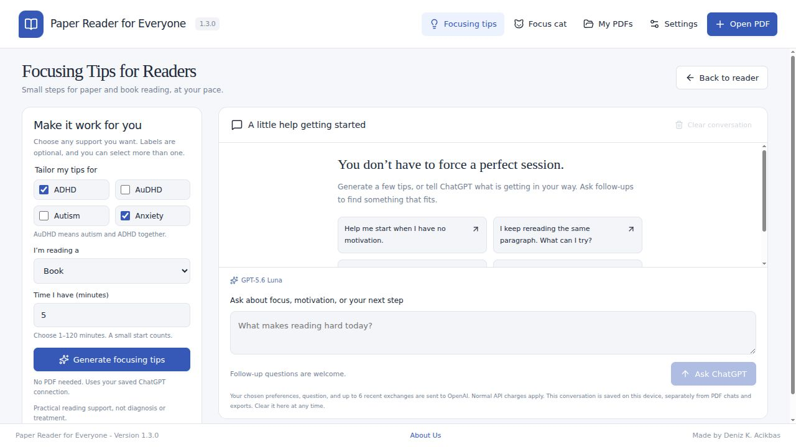

# Paper Reader for Everyone

**Version 1.4.0 · Package revision 1 · Developed by Deniz K. Acikbas**

A simple, installable Linux PDF reader. Highlight a passage or crop a figure, ask ChatGPT a question, and pin the answer as a sticky note on the PDF.


## Screenshots

[View all 10 app screenshots](docs/screenshots/README.md), including the reader, sticky notes, flashcards, settings, and focusing tips in both themes.



## Install on Linux

Download `paper-reader-for-everyone_1.5.1-1_amd64.deb` from [Releases](https://github.com/denizkarya1999/Paper-Reader-for-Everyone/releases/latest).

Open it with your system's software installer, or run this command from your download folder:

```sh
sudo apt install ./paper-reader-for-everyone_1.5.1-1_amd64.deb
```

Launch **Paper Reader for Everyone** from your application menu.

The package targets **64-bit Intel/AMD Debian-based Linux**, including Ubuntu, Debian, and Linux Mint. It is a desktop application built with Electron; you do not need Node.js, a browser, or a running web server to use the installed app. This release does not contain an ARM64 package.

## Use it

1. Choose **Open PDF**, drag a PDF into the window, or try the included example.
2. Ask about the whole paper immediately, or use **Highlight** / **Crop areas** / **Crop & draw** to focus on a passage, figure, equation, table, or scanned area with the rest of the PDF as context.
3. Enter your OpenAI API key in the first-run setup, or open **Settings → ChatGPT connection** later. Choose GPT-6 Astra, GPT-5.6 Sol, Terra, or Luna, or the previous GPT-4.1 models.
4. Type a question and press the arrow button or **Ctrl+Enter**.
5. Choose **Pin as sticky note**. In **Notes**, edit the answer, change its color, or return to its page.
6. Open **Chats** to revisit every question and answer, delete one exchange, or delete all chats for this PDF.
7. Choose **Save PDF** for an annotated copy, or **Save PDF + chats** for a portable ZIP containing both.
8. Open **Settings** for appearance, your API key/model, cat reminders, and local data. Choose **Light** or **Dark** under Appearance.
9. Choose **Flashcards** above the PDF to generate a study set with as many as 50 questions and answers.
10. Open **About Us** in the footer to see the app version, developer, languages, and development agent.

### Summarize or ask about the whole paper

Choose **Summarize paper** above the PDF, or **Whole paper** in the question panel. Then choose **Summarize whole paper** to request the main question, approach, findings, limitations, and takeaway with PDF page references. You can also enter your own question about the complete document.

The app sends the complete original PDF directly to OpenAI for these requests, including page images, figures, tables, scanned pages, and any annotations or metadata already in that file. It does not silently truncate to an abstract or a few pages. Newly added local notes are not included unless they were exported into the PDF you opened. Whole-paper requests require files smaller than 50 MB (50,000,000 bytes), can cost more than excerpt-only requests in older versions, and allow up to five minutes before timing out. Model context limits still apply; very long documents may need to be split. Cancel stops waiting for the response but does not undo content already sent or guarantee that OpenAI stops processing it.

Choose **Save as note on page 1** to keep a summary. It appears as a whole-paper note and is included in annotated PDF exports, with no artificial highlight. Reopen exports in version 1.1 or later to edit these notes.

### Chat history and portable PDF bundles

Every question, answer, selection or crop, model name, and request status is saved automatically with its PDF. Open **Chats** to review exchanges, return to their page, pin answers, or delete individual chats. **Delete all** clears this PDF’s chats; **My PDFs → Delete all chat history on this device** clears chats for every PDF. These actions preserve PDFs and pinned notes. Removing a PDF from the library also removes its chats. Versions before 1.2 did not retain unpinned conversations, so older unsaved chats cannot be recovered.

**Save PDF + chats** writes a standard ZIP containing:

- `paper.pdf`: your complete PDF with its annotated sticky notes.
- `chat-history.html`: a readable transcript, including selected passages and crops; open it in any browser.
- `chat-history.json`: structured chat data for restoring in the app.
- `README.txt`: a short guide to these files.

Open or drop this ZIP in Paper Reader 1.2 or later to restore the PDF and chats together. Reopening the same bundle merges missing chats without duplicating existing ones or replacing local notes. Bundles are limited to 200 MB. Ordinary **Save PDF** exports notes only. A ZIP is a snapshot: later edits and deletions do not change previously saved copies, and reopening a backup can restore chats you deleted locally. Bundles contain your conversations and document, but no API key.

### Settings, appearance, and About Us

**Settings** brings Appearance, ChatGPT connection, Focus cat, App updates, and Local data into one page. API-key replacement/removal, the remembered model, and cat controls work as before. Appearance offers **Light** and **Dark**; the theme is applied immediately and saved on this device. It covers the reader, settings, chats, sticky-note panels, and the cat’s speech bubble. PDF pages and figures keep their original colors, and exported PDFs are unaffected by the interface theme. Your reading position, selections, and draft question remain available when you return from Settings or About Us.

**About Us**, available in the footer and Settings navigation, shows Paper Reader for Everyone, the installed version, developer **Deniz K. Acikbas**, programming languages **TypeScript, JavaScript, HTML and CSS**, and development agent **OpenAI Codex**. Version labels and PDF export metadata use the package version as their source.

### Ask with whole-paper context

Opening a PDF makes the question box ready immediately. Ask any question in **Whole paper**, or choose **Summarize whole paper**. Highlight text or crop an area to focus a question: the full PDF is attached alongside the selection, so ChatGPT can use definitions, methods, results, figures, and limitations from elsewhere in the paper. Supporting PDF page references are requested. Use **Whole paper** or clear the selection to return to general questions; your draft question is preserved. Each question is independent of previous chat answers. If the PDF exceeds a model’s context limit, use a shorter PDF or another model.

### Select multiple crops

Choose **Crop areas** and drag a rectangle around each figure, equation, table, or passage you want to discuss. Each drag adds a numbered crop. You can change pages or zoom and keep collecting, up to **10 crops** per question. The question panel shows every crop with its source page; click the page label to revisit it, use its **×** to remove it, or **Clear selection** to start over. Highlighting text replaces the crop collection with that passage. Drawing a crop while in Whole paper starts a fresh collection.

Type one question, such as “How do these figures relate?”, and choose **Ask ChatGPT** or press **Ctrl+Enter**. The app sends every selected image in order, labeled by PDF page, alongside one copy of the full PDF. Crops stay selected after sending so you can ask another question. Each question is independent and incurs normal API usage, including all attached crops and the full PDF. The app accepts up to 5 MB of encoded data per crop and 20 MB across the collection; a crop exceeding either limit is rejected without losing your existing selections.

**Chats** retains every crop. **Pin as sticky note** links the answer to all selected pages, and **Save PDF** exports crop outlines and a note on each of those pages. PDF exports preserve crop locations without embedding duplicate crop images. **Save PDF + chats** also preserves all crop images in the readable transcript and structured history. Open multi-crop bundles in **version 1.4 or later**; older versions may show only the first crop. Existing single-crop chats and older bundles remain supported.

### Draw on a crop

Choose **Crop & draw**, then drag around the figure or writing you want to discuss. Use the **Pen**, **Highlighter**, **Arrow**, or **Circle** tool, choose an ink color and line size, and select **Use marked crop**. Undo, redo, or clear marks as needed. **Cancel** leaves the existing crop unchanged. Each crop can contain up to 100 marks; a freehand mark records up to 1,000 points. Crops are limited to 1,600 pixels on the longest edge.

The crop preview and image sent to ChatGPT include your marks. Use **Draw on crop / Edit drawing** below any selected crop to revise it. Pin an answer or your own note to keep the drawing on the page. **Save PDF** exports native ink annotations with pinned notes for other PDF readers; **Save PDF + chats** also retains editable crop images and marks from saved chats. Open drawings in version **1.5 or later**. Imported PDF notes keep their vector marks; to edit an original crop image, reopen its chat from the ZIP bundle.

### Read AI answers aloud

Press **Read aloud** beside an answer to hear OpenAI’s natural **Marin** AI voice in **American English**. Controls appear for paper and selection answers, saved chats, notes, flashcard questions and revealed answers, focusing tips, and the cat’s quizzes. Use the shared playback bar to **Pause**, **Resume**, or **Stop**. Starting another answer stops the previous one.

Speech uses the API key already configured under **Settings → ChatGPT connection** and incurs OpenAI speech API charges each time you request it. Only the text you choose to read is sent for speech; no PDF is attached to a speech request. Audio is kept in memory, not saved to disk. Long answers are read in consecutive segments; stopping prevents further segments from being requested but does not undo API usage already incurred. An internet connection and an account with access to `gpt-4o-mini-tts` are required.

### Read the current PDF page

Choose **Read this page aloud** in the PDF toolbar. The app speaks the current page with the same American English AI voice and shared pause/resume/stop controls. Changing pages or opening another document stops page playback. The PDF page number appears in the playback bar.

Pages with selectable text are read in their stored text order, which can vary for complex columns. Pages without a text layer are sent as a single page image to OpenAI for text recognition, then spoken; both recognition and speech incur API charges. Recognition may misread difficult scans, equations, or handwriting. Other PDF pages are not attached. Cancel during preparation or stop during playback. Pages over 20,000 characters are reported instead of silently cut short.

### Automatic updates

Starting with version **1.5**, the installed Linux app checks this repository’s public GitHub releases shortly after launch and every four hours while running. A newer stable release is downloaded automatically and its checksum verified. Choose **Install and restart** when ready; Linux may ask for your administrator password. Saved PDFs, notes, chats, and connection settings remain in the same local data folder.

Open **Settings → App updates** to check manually or turn automatic checking and downloading off. An already-started download may finish when the preference is turned off. The app never installs an update merely because you close it. Versions before 1.5 need one manual upgrade. Future `v*` tags run the build and tests before publishing the `.deb`, `latest-linux.yml`, and checksums used by the updater.

### Generate and study flashcards

Open a PDF and choose **Flashcards** above it. Enter a number from **1 to 50** and choose **Generate flashcards**. The app asks your selected ChatGPT model for that many distinct question-and-answer cards grounded in the PDF, with supporting PDF page references. Each card has a question side and a revealable answer side. Use Previous/Next to study, **Read source** to revisit the cited page, or pin an answer as a PDF note.

Sets larger than 10 cards are generated in batches of at most 10. **Every batch sends the full PDF to OpenAI and incurs normal API usage.** A short or unreadable paper may not support the requested number; invalid, duplicate, truncated, or out-of-range responses are reported rather than presented as a complete set. Completed batches are saved immediately and remain available after cancellation, interruption, or a later batch failure.

Each set is stored as an entry in the PDF’s chat history and appears under **Saved sets**. Delete a set from Flashcards or Chats; clearing chat history also clears its flashcard sets. Pinned notes are preserved. **Save PDF + chats** includes complete cards in both the readable HTML transcript and structured JSON. Open these bundles in **version 1.3 or later** to restore and study the flashcards. Older PDF/chat bundles still open normally.

### Focusing Tips for Readers

Choose **Focusing tips** in the header, even before opening a PDF. Optionally select **ADHD**, **AuDHD**, **Autism**, or **Anxiety** (multiple choices are supported), choose **Research paper** or **Book**, and set the time you have from 1 to 120 minutes. Select **Generate focusing tips**, use a starter question, or describe a focus or motivation difficulty in your own words. Follow-up questions can adapt earlier suggestions.

This page uses your saved API key and selected model. It sends only the chosen support preferences, your question, and up to six recent completed question-and-answer exchanges to OpenAI. It does not attach the open PDF or its chat history. Normal API charges apply. Preferences are optional and are not treated as a diagnosis. Responses are practical educational reading support, not diagnosis, treatment, or medication advice.

The focusing conversation and preferences are saved on this device, separately from PDF chats and exports. Delete individual exchanges or choose **Clear conversation** on this page. Clearing PDF history does not clear this separate conversation. Up to 100 exchanges can be kept; clear the conversation to begin again when it is full. Earlier long answers may be shortened in follow-up context. Cancelled, failed, and interrupted exchanges are shown but are not sent as conversation context. Loading this page does not make an API request.

### Your focus cat

Choose **Focus cat** in the header, turn on **Show my cat**, give it a name, and choose ginger, gray, or cream. It walks along the bottom of your desktop, above ordinary windows, while Paper Reader remains open. Set a reminder interval from 1 to 10,080 minutes, or choose **Never** to keep the cat without timed reminders. Turn off **Show my cat** or click **Hide cat** in its speech bubble to disable it. Preferences survive restarting. Closing Paper Reader closes the cat; it does not launch itself at login. Desktop appearance and placement depend on the Linux window manager and compositor.

Simple reminders such as “Did you understand what they say?” work offline. The cat uses a timer, not activity monitoring: it does not read other apps, capture your desktop, or detect distraction. Click the cat for a check-in. Dismiss a reminder to start the next interval; reminders do not stack while a bubble is open. Sleep pauses reminders and starts a fresh interval on resume.

Enable **Ask me ChatGPT quizzes about my PDF** to generate a recall question from the open paper at reminder time. The complete PDF is sent to OpenAI with your saved API key and current model, with preference for the page you are reading. **Each generated quiz incurs normal API usage.** No request is made when the cat is disabled, when a timer is set to Never (unless you click the cat), without an open PDF/key, or while another request is in progress. **Reveal answer** shows the model answer with a requested source page reference; check it against the paper. Quiz questions and answers are saved in **Chats** and included in portable bundles. Changing PDFs, hiding the cat, or dismissing a pending reminder cancels waiting for that quiz. The model may still process content already sent.

### Models

GPT-5.6 Luna is the default for economical everyday reading. Select **GPT-6 Astra** under **Settings → ChatGPT connection → Model** for the most capable option, or GPT-5.6 Sol / Terra for other tradeoffs. GPT-4.1 mini and GPT-4.1 remain available. Your chosen model is saved with your connection and shown above the question box, and answers retain the name of the model that generated them. Account access varies; the app reports an unavailable model instead of silently substituting another.

The model IDs and request settings were checked against [OpenAI's model catalog](https://developers.openai.com/api/docs/models) and [GPT-6 Astra guidance](https://developers.openai.com/api/docs/guides/latest-model). Modern reasoning models use low reasoning effort, with extra output space for reasoning and summaries. These choices are fixed in this release, not automatically updated when new models appear.

You can also use **Write a note** to add your own note without ChatGPT. Reading, selection, notes, and PDF export work offline.

## Local files and privacy

- PDFs, notes, and chat history are saved automatically in the app's local IndexedDB library, under your system's application-data directory (`~/.config/paper-reader-for-everyone` on most Linux systems).
- The app has no sign-in, cloud library, or analytics. Document uploads occur when you ask ChatGPT a PDF question, generate flashcards, or enable timed PDF quizzes. Focusing Tips sends only the support preferences and conversation described above.
- Every PDF question sends the complete PDF to OpenAI for context. **Selection** adds the highlighted passage or cropped image and its page number, focusing the answer on that area while connecting it to relevant material elsewhere. **Whole paper** asks about the document without a selection and is selected automatically when you open a PDF or clear a selection. The interface explains what is sent; full-PDF requests can take longer and cost more than excerpt-only questions.
- First-run setup asks for your OpenAI API key. **Remember my key on this device** is enabled by default when secure storage is available. The key is encrypted using Electron safeStorage and the Linux system keyring, saved in an owner-only (0600) connection file, and loaded automatically on later launches. Your selected model is also remembered.
- **Connection** lets you replace the key, change models, or **Remove key**. Leave the replacement field blank to keep the existing key. The decrypted saved key remains in the desktop main process; it is not returned to the PDF interface, saved in the PDF library, or exported with a PDF.
- GNOME Keyring or KWallet must be available and unlocked to remember keys. LXQt/LXDE use the Secret Service backend explicitly. The app refuses Electron's unprotected Linux fallback; when secure storage is unavailable, setup offers session-only use and explains how to enable persistence. Choosing session-only use removes any previously saved key. A locked or damaged saved connection can be replaced or removed without affecting PDFs and notes.
- Saving checks the key's format locally. Account validity and model access are checked by OpenAI when you send a question; setup does not make a billable request.
- API usage requires an OpenAI API account and billing; a ChatGPT subscription does not include API usage. [Get an API key](https://platform.openai.com/api-keys).
- The app requests `store: false` for generated responses. OpenAI's own [data controls and retention policies](https://developers.openai.com/api/docs/guides/your-data) still apply.
- Save PDF + chats bundles to back up all your work or move it to another device. Chat history stays local and is not automatically attached to later questions; quizzes include a few previous quiz questions to reduce repetition. Clearing or deleting the app's data directory removes the local library.

## PDF compatibility

Exports retain the original pages and add standard PDF highlight, square, text-note, and popup annotations. Readers such as Okular or Adobe Acrobat can open the sticky-note comments; some browser PDF viewers do not display every annotation type. The app also embeds its own note metadata so exported files can be reopened here for continued editing without duplicating notes.

This version supports PDFs up to **50 MB**. Open an unlocked copy of password-protected files. Text selection requires a text layer; use a crop for scanned pages. AI answers always use the complete PDF; selections focus the question on a passage or crop within that context. Check answers against the source. Exporting modifies a copy of the PDF and does not preserve cryptographic signature validity. Existing annotations from other readers are preserved but are not editable in this app's Notes panel.

## Build from source

Requirements: Linux, Node.js **22.13 or newer**, and npm. A graphical Linux session is needed to launch Electron. Package generation may download Electron and its Linux packaging tools.

```sh
git clone https://github.com/denizkarya1999/Paper-Reader-for-Everyone.git
cd Paper-Reader-for-Everyone
npm ci
npm run typecheck
npm test
npm start
```

Create the Debian installer:

```sh
npm run package:deb
```

Run the desktop multi-crop interaction test after building with `npm run test:ui`. On a headless Linux host, use `xvfb-run --auto-servernum npm run test:ui`. It uses an isolated test library and simulated API responses, without sending your files or using your API key.

The installer is written to `release/`. `npm run package:dir` makes an unpacked desktop build. `npm run dev` previews the renderer for layout development only; native dialogs and ChatGPT run in the Electron app.

## Implementation

- **Electron**: a sandboxed, isolated renderer, narrow validated IPC bridge, native open/save dialogs, and direct OpenAI requests in the main process.
- **React + TypeScript + Vite**: the desktop interface.
- **PDF.js**: page rendering, text selection, and cropped image capture, with all workers, fonts, character maps, and decoders packaged locally.
- **pdf-lib**: interoperable PDF annotations and editable note round trips.
- **IndexedDB**: device-local documents, notes, and chat history with atomic deletion and import.
- **fflate**: portable ZIP bundles with annotated PDFs and HTML/JSON transcripts.
- **OpenAI Responses API**: text, image, and complete PDF questions. See [file input documentation](https://developers.openai.com/api/docs/guides/file-inputs) and [image input documentation](https://developers.openai.com/api/docs/guides/images-vision).

The automated test suite covers export/reimport, Unicode, rotations, existing annotations, duplicate prevention, deletion, input validation, selected-content requests, full-PDF payloads, all model options, summary note round trips, cancellation, response limits, API error handling, and protected-key save/restore/replacement/removal, legacy-library migration, chat deletion races, bundle round trips and validation, cat settings/timer/cancellation behavior, and flashcard counts, batching, cancellation, validation, and bundle round trips. The system keyring was also checked locally with a test-only value; no OpenAI request was made. Live OpenAI responses require your own valid API key; tests use simulated API responses and do not incur API charges.

## License

[MIT](LICENSE). Copyright © 2026 Deniz K. Acikbas.
