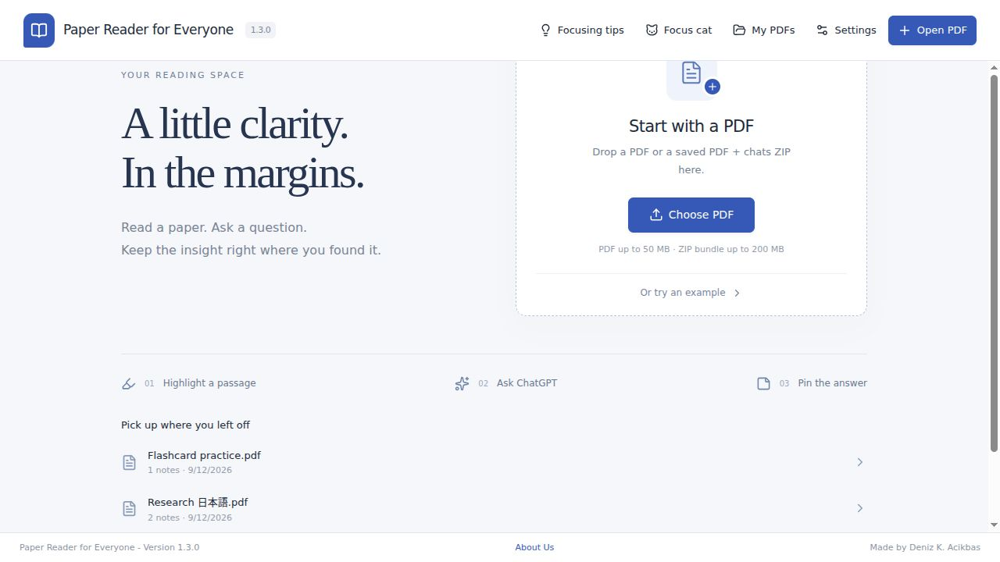
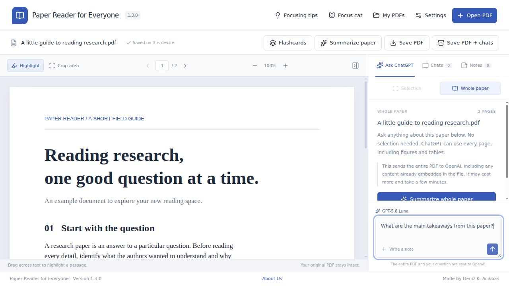
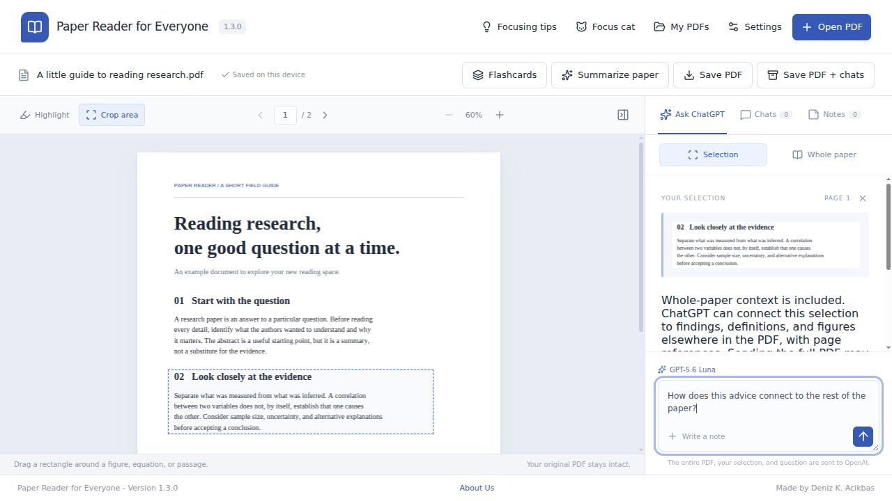
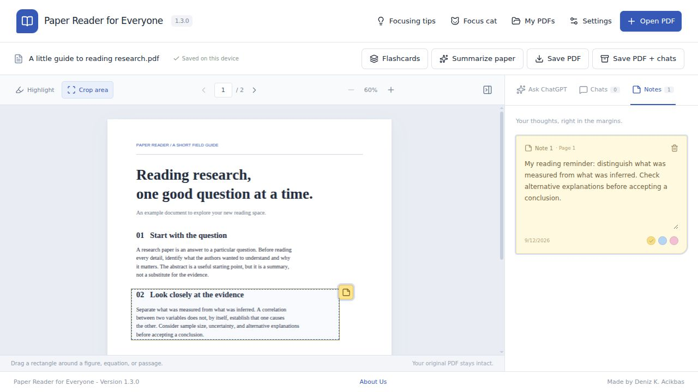
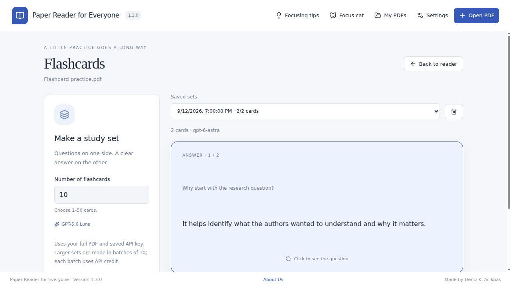
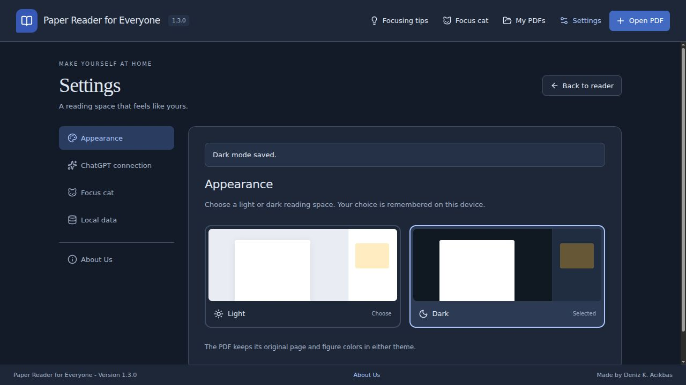
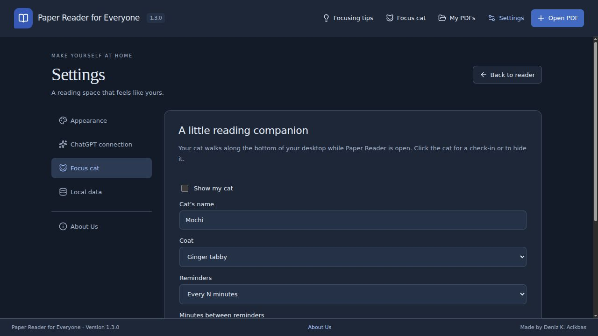
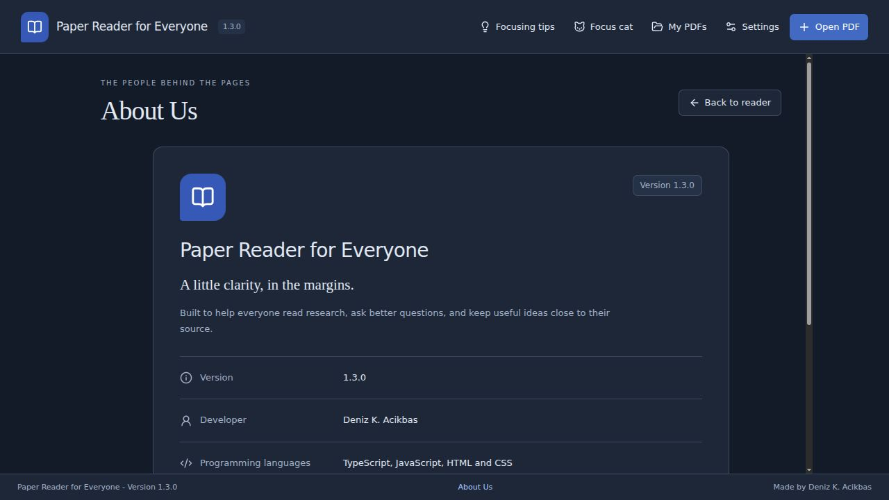
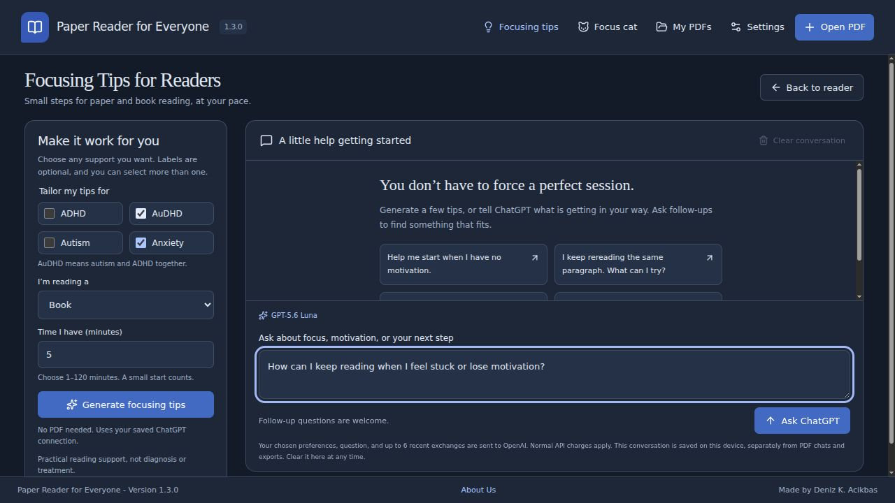

# App screenshots

Ten screenshots of the version 1.3.0 app interface, captured from its renderer using the bundled example and sample study data. These are demonstration preferences and content, not personal reading data or live ChatGPT answers. The installed Linux application uses this same interface.

## 1. Welcome

## 2. Whole-paper questions

## 3. Crops with paper context

## 4. Sticky notes

## 5. Flashcards

## 6. Dark mode settings

## 7. Focus cat settings

## 8. About Us

## 9. Focusing tips: light

## 10. Focusing tips: dark

